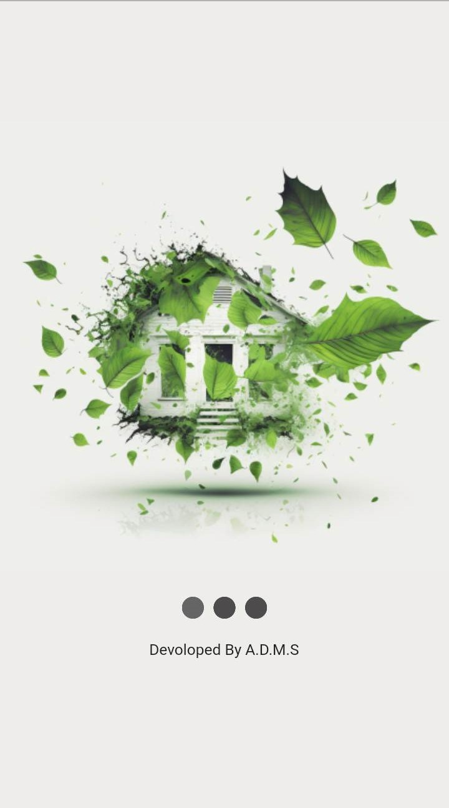
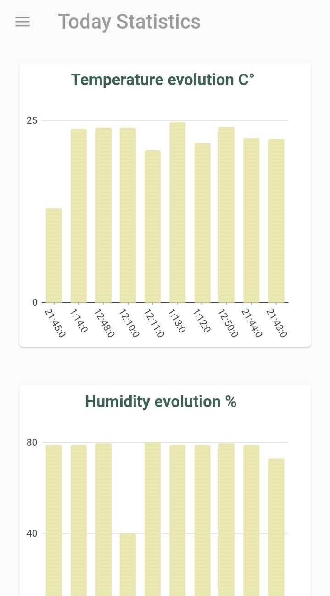

# MyGreenHouse
A Flutter mobile application that allows you to control and monitor your green house.
application dedicated mainly to farmers.

## Features
- Connect to an ESP32 board through an MQTT broker
- View real-time sensor data such as temperature and humidity.
- Control the state of your devices such as UV-lights, water pipe.
- Receive push notifications for important events
- Emergency calls in critical conditions
- Statistics on saved data from sensors

## Installation
This project is built with Flutter framework and uses the following dependencies:
- [MQTT](https://pub.dev/packages/mqtt) for connecting to the ESP32 board
- [Firebase](https://pub.dev/packages/firebase_auth) for authentication 
- [Firebase](https://pub.dev/packages/cloud_firestore) for saving data 
- [Notifications](https://pub.dev/packages/flutter_local_notifications) for notifications

1. Install Flutter by following the instructions on the [Flutter website](https://flutter.dev/docs/get-started/install)
2. Clone this repository by running: 
git clone https://github.com/Ala-Mabrouk/MyGreenHouse.git
3. Install the required packages by running:
flutter pub get
4. The code of the simulation is in "code Circuit ESP32.py" file or you can use the following simulation project for testing :
https://wokwi.com/projects/350213119863161428

## Usage

1. Open the app on your device by running:
flutter run
2. login in using:
email: "bf.foulen@mail.com"
password: "012345678"
3. Control your devices and monitor sensor data
    
## Contact

If you have any questions or would like to get in touch with the me, please email me at [alamabrouk007@gmail.com](mailto:alamabrouk007@gmail.com)

## Screenshots

Here are some screenshots of the app in action:

 

 
 

